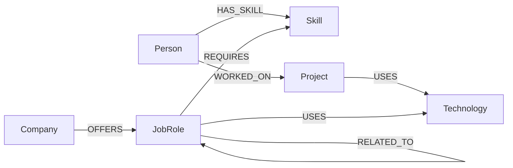
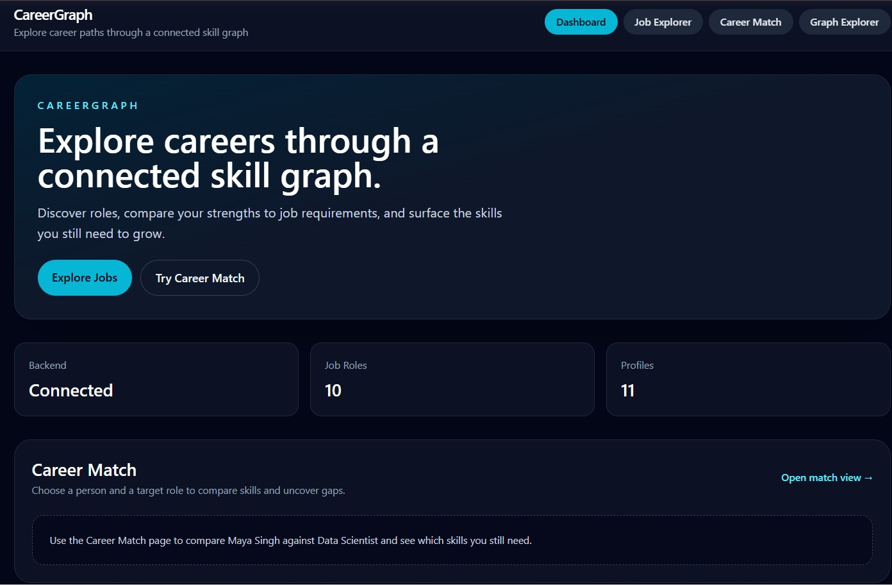
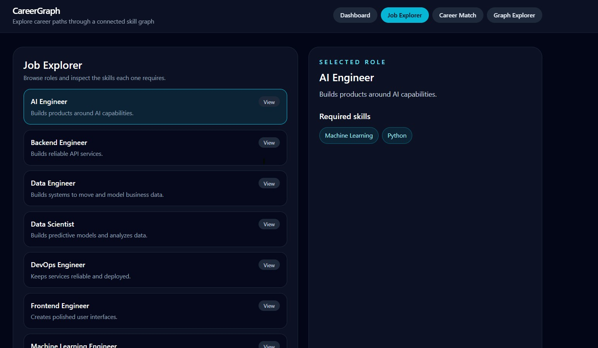
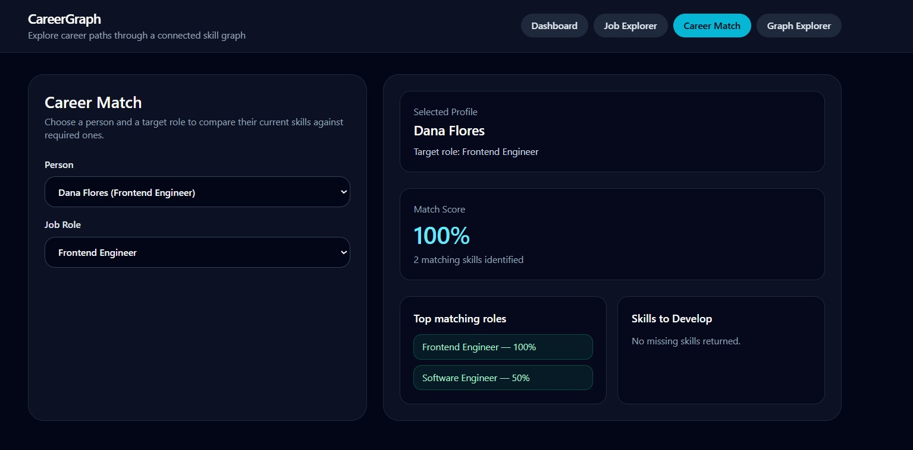
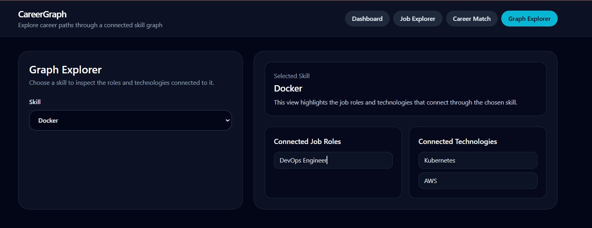

# CareerGraph

## Overview

CareerGraph is a career exploration web application that uses a graph database to connect people, skills, job roles, technologies, projects, and companies. Users can browse roles, inspect required skills, compare a person’s skill profile against a target role, and explore how specific skills link to roles and technologies.

## Problem / Use Case

Job seekers and career planners often need to understand which skills map to which roles, what skills they already have, and where their gaps are for a desired position. CareerGraph solves this by modeling people, skills, jobs, technologies, projects, and companies as connected data, then surfacing role matches and missing skill recommendations.

## Why a Graph Database?

CareerGraph uses CognoDB because career data is naturally relationship-driven. The graph connects:

- `Person` → `Skill`
- `Skill` → `JobRole`
- `JobRole` → `Technology`
- `Person` → `Project`
- `Project` → `Technology`
- `Company` → `JobRole`

This makes queries across multiple hops intuitive and efficient. For example, finding roles linked to a person’s skills or technologies used by roles requires traversing relationships rather than joining multiple tables.

Compared to a relational database, graph queries are more natural for this domain because the data is modeled as nodes and edges. Multi-hop traversals like `Person` → `Skill` → `JobRole` → `Technology` can be expressed directly in Cypher, while a relational approach would require many joins and schema changes to represent the same relationships.

## Key Features

- Job Explorer
- Career Match
- Missing Skills
- Graph Explorer
- Live CognoDB-backed data

## Architecture

React
  ↓
FastAPI
  ↓
Neo4j Python Driver
  ↓
CognoDB

## Graph Data Model

### Node Labels

- `Person`
- `Skill`
- `JobRole`
- `Technology`
- `Project`
- `Company`

### Relationships

- `HAS_SKILL`
- `WORKED_ON`
- `USES`
- `REQUIRES`
- `RELATED_TO`
- `OFFERS`

## Graph Diagram



## Technology Stack

- React
- Vite
- Tailwind CSS
- FastAPI
- Python
- Neo4j Python Driver
- CognoDB
- python-dotenv

## Project Structure

```
careergraph/
├── AGENT_CONTEXT.md
├── PROGRESS.md
├── README.md
├── backend/
│   ├── app/
│   │   ├── main.py
│   │   ├── routes/graph_routes.py
│   │   └── services/graph_service.py
│   ├── database/
│   │   └── connection.py
│   └── tests/
│       └── test_app_import.py
├── cypher/
│   ├── 01_job_roles.cypher
│   ├── 02_job_skills.cypher
│   ├── 03_job_matches.cypher
│   ├── 04_missing_skills.cypher
│   ├── 05_multi_hop.cypher
│   └── 06_graph_exploration.cypher
├── frontend/
│   ├── package.json
│   ├── postcss.config.js
│   ├── tailwind.config.js
│   ├── vite.config.js
│   └── src/
│       ├── App.jsx
│       ├── main.jsx
│       ├── services/api.js
│       ├── components/Layout.jsx
│       ├── pages/Dashboard.jsx
│       ├── pages/JobExplorer.jsx
│       ├── pages/CareerMatch.jsx
│       └── pages/GraphExplorer.jsx
├── scripts/
│   └── seed.py
└── .gitignore
```

## Getting Started

### Prerequisites

- Python 3.13+
- Node.js 18+
- npm
- CognoDB Cloud account
- Local `.env` file for backend credentials
- Local front-end environment variable file as needed

## CognoDB Setup

1. Create a CognoDB Cloud account.
2. Create a free C0 database instance.
3. Obtain the connection URI, username, and password from the CognoDB dashboard.
4. Store them in the project root `.env` file.

Do not store real credentials in source control.

## Environment Variables

Create a `.env` file in the project root with:

```env
COGNODB_URI=bolt+s://<your-cognodb-host>
COGNODB_USERNAME=<your-username>
COGNODB_PASSWORD=<your-password>
```

For the frontend, use `VITE_API_URL` in `frontend/.env` if the backend is hosted at a different address:

```env
VITE_API_URL=http://127.0.0.1:8000
```

## Backend Setup

From the repository root:

```bash
python -m venv .venv
.\.venv\Scripts\activate
pip install -r backend/requirements.txt
```

Then run the backend with:

```bash
cd backend
.\.venv\Scripts\python.exe -m uvicorn app.main:app --host 127.0.0.1 --port 8000
```

## Seed Data

Run the seed script to populate CognoDB:

```bash
python scripts/seed.py
```

This script creates nodes and relationships for people, skills, job roles, technologies, projects, and companies.

## Cypher Queries

Important query files in `cypher/`:

- `01_job_roles.cypher`: returns all job roles.
- `02_job_skills.cypher`: returns required skills for a job role.
- `03_job_matches.cypher`: finds job roles that match a person’s existing skills.
- `04_missing_skills.cypher`: returns skills a person is missing for a target job role.
- `05_multi_hop.cypher`: demonstrates a multi-hop traversal from `Person` through `Skill` to `JobRole` and `Technology`.
- `06_graph_exploration.cypher`: explores skill connections to job roles and technologies.

### Multi-hop Traversal

The multi-hop query (`05_multi_hop.cypher`) traverses:

- `Person` → `HAS_SKILL` → `Skill`
- `Skill` → `REQUIRES` → `JobRole`
- `JobRole` → `USES` → `Technology`

This demonstrates why a graph is useful: it follows a natural path through connected career data to reveal technologies tied to roles matched by a person’s skills.

## API

Implemented endpoints:

- `GET /api/jobs`
- `GET /api/jobs/{job_id}`
- `GET /api/jobs/{job_id}/skills`
- `GET /api/people`
- `GET /api/skills`
- `GET /api/people/{person_id}/matches`
- `GET /api/people/{person_id}/missing-skills/{job_id}`
- `GET /api/skills/{skill_id}/connections`
- `GET /health/db`

## Frontend

From the `frontend` folder:

```bash
npm install
npm run dev -- --host 127.0.0.1 --port 3000
```

Then open `http://127.0.0.1:3000` in your browser.

## Screenshots


*Dashboard*


*Job Explorer*


*Career Match — Maya Singh → Data Scientist*


*Graph Explorer — Python connections*

## Demo

- Hosted demo URL: _placeholder for demo URL_

## Screen Recording

- Screen recording URL: _placeholder for screen recording URL_

## Wexa Assignment Requirements

- Thoughtful graph data model: modeled people, skills, roles, technologies, projects, and companies.
- Realistic seed data: implemented in `scripts/seed.py`.
- Seed script included: `scripts/seed.py`.
- Cypher queries included: stored in `cypher/`.
- Multi-hop traversal: `05_multi_hop.cypher`.
- Graph relationship query use case: person skills → job roles → technologies.
- Parameterized queries: job role, person, skill, and missing-skill queries use parameters.
- Functional web application: React frontend consuming FastAPI backend.
- Clean UI/UX: simple role browsing and match views.
- Database credentials from environment variables: `.env` usage in backend.
- No credentials committed: `.gitignore` excludes `.env` and local build artifacts.
- Graceful database error handling: backend wraps DB errors and returns HTTP 503.

## Security Notes

Credentials are loaded from environment variables and stored in `.env`. The `.env` file is excluded from Git in `.gitignore`, and frontend build output is ignored as well.
